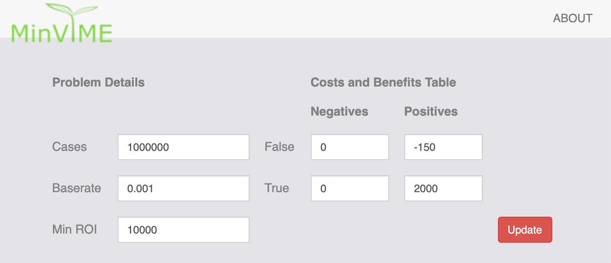
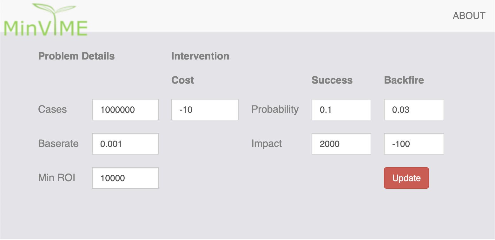

Usage Guide
===========

Launch the MinViME application from the command line:

.. code-block:: bash

    >minvime
    * Serving Flask app "minvime.minvime" (lazy loading)
    ...

As shown above this command will instantiate a Flask web server 
and make the minvime applictation available on the default IP:Port combination.

When you navigate to that address the initial screen will prompt you for the
type of business problem you are try to solve. As shown in the screenshot
below.

.. image:: images/minvime_00.png
   :width: 600

In both of these cases the underlying analysis will be the same cost/benefit.
However, in the intervention analysis MinViME will calculate the cost/benefit
table from statistics you enter about the effectiveness of historical interventions.
If the intervention effectiveness is something you are uncertain about, then we
recommend that you perform the analysis using boundary estimates.

Cost Matrix Analysis
^^^^^^^^^^^^^^^^^^^^

.. image:: images/minvime_02.png
   :width: 600 

Intervention Analysis
^^^^^^^^^^^^^^^^^^^^^

